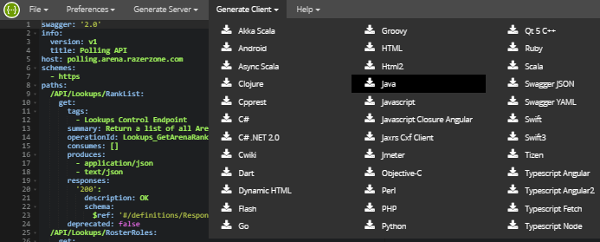
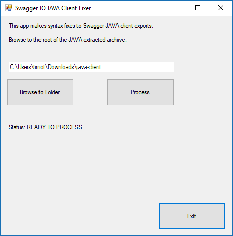

# Description

This Windows.Form project makes syntax fixes to the JAVA client export from the [Swagger Editor](http://editor.swagger.io/).

Automates JAVA syntax fixes for the okhttp3 upgrade.

* [Using JAVA client to workaround Android client issues](https://github.com/swagger-api/swagger-codegen/issues/4300)

